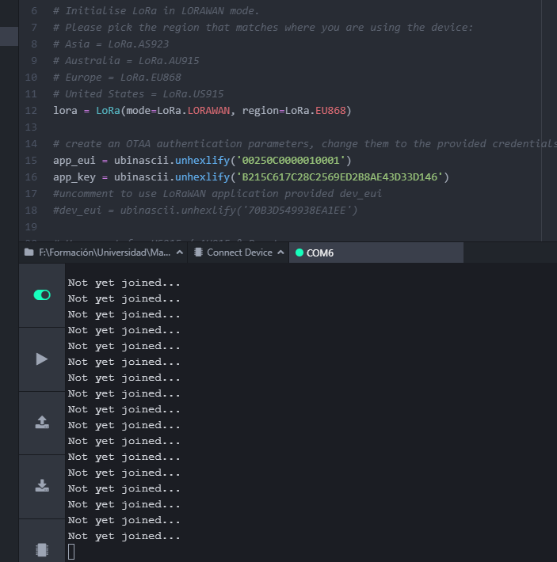
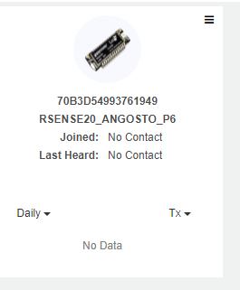
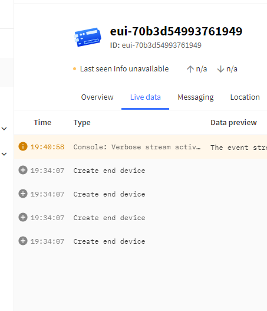
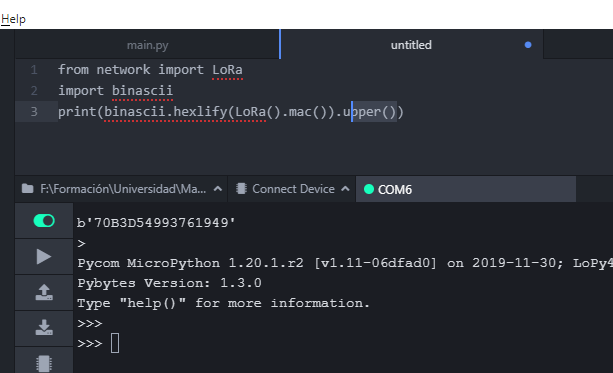

# RSENSE20_ANGOSTO_P6

Desarrollado para pluging pymakr de Pycom para el módulo LoPy4.
Repositorio para la práctica P6 de redes de sensores.

## Programa base:
Commit 40b461fa.

Realiza una comunicación Ping Pong entre dos módulos LoPy4, uno envía cada 4 segundos un Ping por puerto serie y comunicació LoRa. El otro envía un Pong por puerto serie. Además se realiza una secuencia de colores para indicar los cambios.

### Montaje

### Videos de mostrativos

[Video Ping-Pong](https://vimeo.com/592335496)

## Comunicación LoRaWan:
Commit 82f555ae.

No se consigue implementar este punto. Se sigue las indicaciones del fabricante (Pycom) para la conexióna a los servicios de TheThingsNetwork y Senet. En ambos casos sin exito, se prueba usando la MAC del dipositivo como device EUI y una generada por el servicio. También en base a la documentación de Pycom se asegura que la configuración de LoraWAN en los serivicios sea la correcta.

### Capturas del trabajo realziado

---
## Bibliografía:

* [Configuración ATOM LoPy4](https://docs.pycom.io/gettingstarted/software/atom/)
* [Inicio con LoPy4](https://docs.pycom.io/gettingstarted/)
* [Documentación LoRa LoPy4](https://docs.pycom.io/tutorials/networks/lora/)
* [Comunicación módulo a módulo LoPy4](https://docs.pycom.io/tutorials/networks/lora/module-module/)
* [Control RGB LED LoPy4](https://docs.pycom.io/tutorials/basic/rgbled/)
* [OTAA vs ABP](https://www.thethingsindustries.com/docs/devices/abp-vs-otaa/)
* [SENET](https://portal.senetco.io/)
* [Conexión a SENET](https://docs.pycom.io/gettingstarted/registration/lora/senet/)
* [Conexióna The  thing Network](https://docs.pycom.io/gettingstarted/registration/lora/ttn/)
* [Conexión LoraWAN OTAA](https://docs.pycom.io/tutorials/networks/lora/lorawan-otaa/)
---
David Angosto Latorre, 633706
